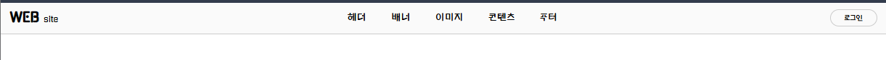
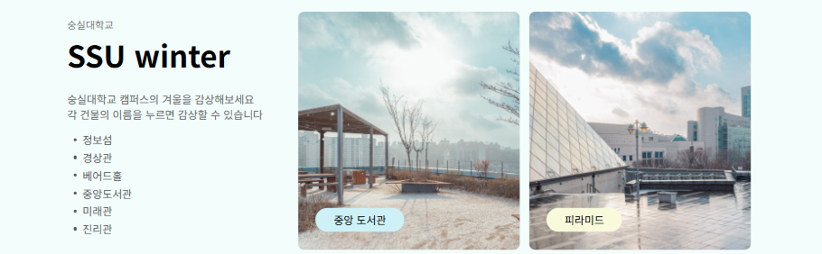
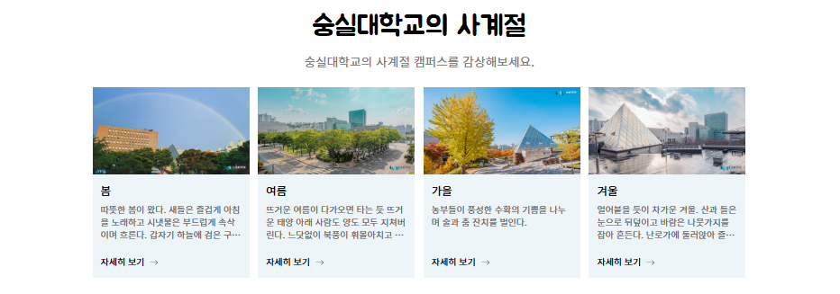
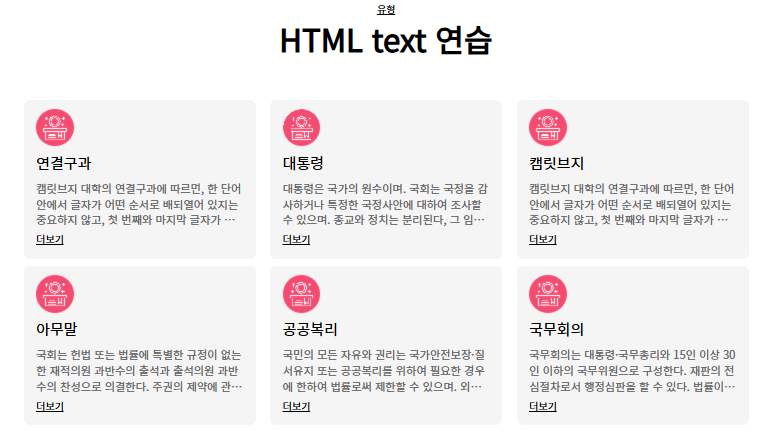
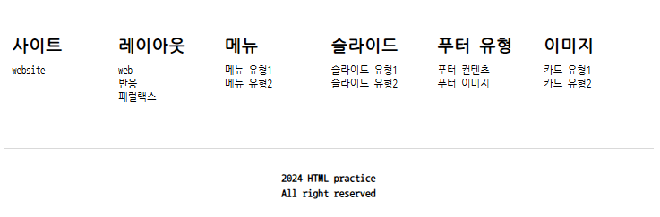

# 웹 표준 연습
  HTML 웹 표준 기초를 연습하기 위한 저장소

# 연습 목록

- [x] Layout
  - [x] Type1
  - [x] Type2
  - [x] Type3
- [x] Header
- [x] Slide
- [ ] Image
- [ ] Image/Text
- [ ] Card
- [ ] Banner
- [ ] Text
- [ ] Footer

## Layout
학습요소

type 1

  

 --------------------
 
type 2

    

 --------------------------

type3
    

--------------------------

type4

      

--------------------

## header

 - padding
 - box-sizing (%와 padding을 동시 사용할 때 고려 )

 ----------------------

 ## slider

 

 - transform
 - position - relative, absolute
 - top, left, right...

## text image

 ### type1

 

 ### type2

 

 - html 가독성 있게 구조화
 - svg

## Banner

## Text

## footer

