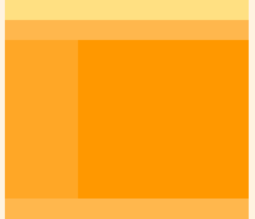

# 웹 표준 연습
  HTML 웹 표준 기초를 연습하기 위한 저장소

# 연습 목록

- [ ] Layout
  - Type1
    - [x] float / response
    - [x] flex / response
    - [x] grid / response
  - [ ] Type2
  - [ ] Type3
  - [ ] Type4
  - [ ] Type5
- [ ] Header
- [ ] Slide
- [ ] Image
- [ ] Image/Text
- [ ] Card
- [ ] Banner
- [ ] Text
- [ ] Footer

## Layout
학습요소

type 1
  

 - response
 - float
    - height = 0 되는 버그 막는 방법
      - 다음에 오는 요소에 clear : both
      - overflow : hidden ( 추천 x )
      - clearfix :: 가상요소를 이용하여 clear : both 관리 (추천)
 - flex : 가장 간단하지만, 자식 요소의 width를 잘 조절할 필요가 있다.
 - grid : 배치가 직관적이라 복잡하나 배치의 경우 용이하다. 부모 속성만 변경하여 배치

type 2
    
 - float : clearfix 추가하면 문제될 것은 없음
 - flex : 한 블록 안에 가로 세로가 섞여있을 경우, 박스을 세분화 시켜야함. 더욱 복잡해진다. 즉 아래와 같은 그림은 새로운 박스로 묶어야하는 불편함이 있다.
 - grid
